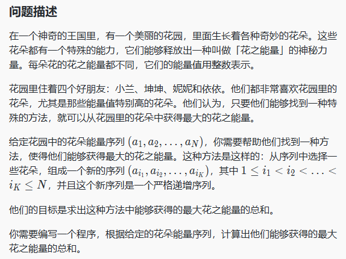
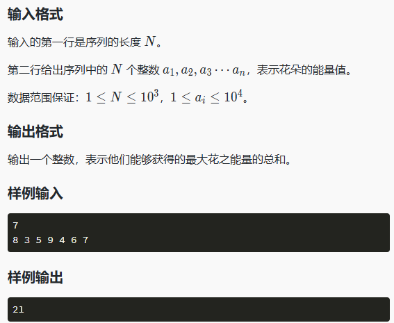
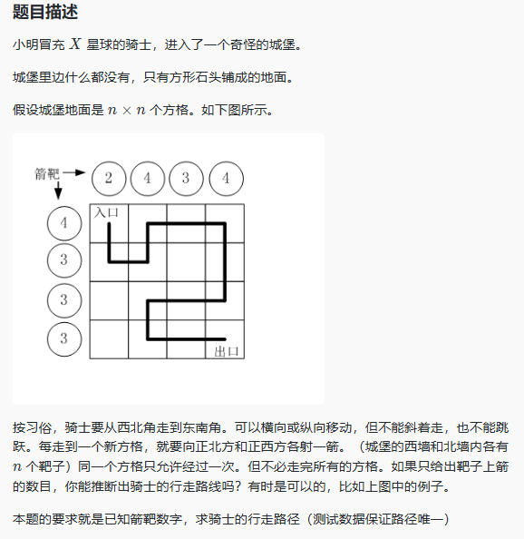
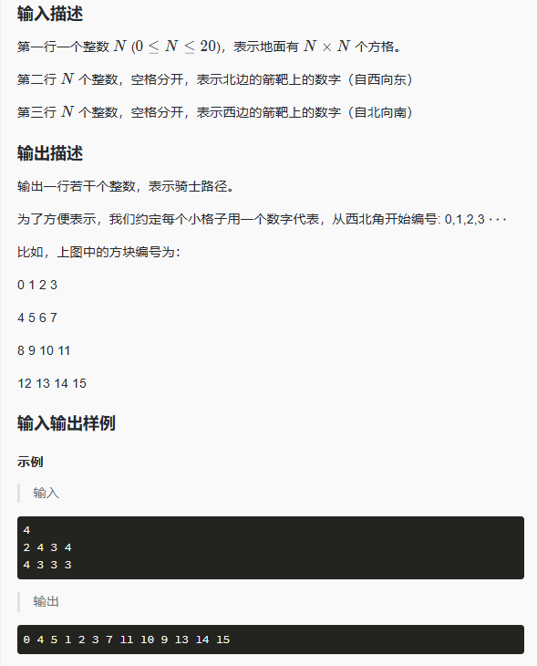

# 刷题笔记

#### **KMP 算法--魔法世界**

```
【问题描述】

小蓝拥有一个神奇的魔法法器，其中有两个宝箱，一个是长度为 n的数列 A ，而另一个是长度为 m的数列 B 。这两个宝箱内的数值都是来自于魔法大陆上的神秘符文，它们蕴含着神奇的力量。小蓝意识到，如果能够找到符合特定条件的魔法数列 A′，他就能够通过法器释放出更强大的魔法。

这个特定的条件非常有趣，需要小蓝找到数列 A中长度为 m的连续子序列 A′，使得对于每个 A′的元素 Ai′与数列 B 中对应位置的元素 Bi ，它们相加后对某个神秘的数 k
 取模的结果都相同。也就是说， 
(A1′+B1)%k=(A2′+B2)%k=……=(Am′+Bm)%k成立。

肖恩对这个问题充满了好奇和憧憬，他相信只要能解决这个魔法之谜，就能够为魔法世界带来更多的欢乐和惊喜。现在，他希望能得到你的帮助。

【输入描述】
第一行输入三个整数 n,m,k三个数字的意义分别如题目所述。

第二行输入 n 个整数， Ai表示一个宝箱中的第 i 个数字。

第三行输入 m 个整数， Bi表示另一个宝箱中的第 i 个数字。

【数据保证 】
2≤m≤n≤2×105,1≤ai,bi,k≤109
2≤m≤n≤2×10 5 ,1≤ai

【输出描述】
输出一个数字，表示能找到的符合条件的 A′的数量。
```

```

```

#### 盾神与简单数独

```
【问题描述】
有一天，盾神接触到了风靡世界的小游戏——数独！！！盾神非常感兴趣，不惜翘课用了一天的时间把数独玩得出神入化！！！于是他要过来考考你。
听到你“雅蠛蝶”的叫声，盾神心软了，于是把经典的9*9的棋盘缩小到4*4的。规则和原来一样，只是要填的数变成从1到4。于是你会做了。
【输入格式】
输入为4*4的矩阵，如果第i行第j列为0，则该格子未填数；否则该格子已经有数。
【输出格式】
输出为若干个4*4的矩阵，表示所有方案，按字典序升序排列。在最后新起一行输出#表示输出结束。方案之间，方案与#之间空一行。
矩阵大小关系的定义：第一关键字为a[1][1]，第二关键字为a[1][2]，……第四关键字为a[1][4]，第五关键字为a[2][1]，以此类推。矩阵A小于矩阵B，当且仅当存在k，A和B的前k-1个关键字的值都相等，而A的第k个关键字的值小于B的第k个关键字的值。矩阵A等于矩阵B，当且仅当A小于B和B小于A都不成立。
字典序升序的定义：在矩阵序列a中，对于任意的i<=j，有a[i]<=a[j]。

【样例输入】
1 2 3 4
3 4 1 2
0 0 2 1
0 0 0 0
【样例输出】
1 2 3 4
3 4 1 2
4 3 2 1
2 1 4 3
#
【样例输入】
0 0 4 4
0 0 0 0
0 0 0 0
0 0 0 0
【样例输出】
#
【数据规模和约定】
矩阵中所有数的值为0到4。
```

```c++
#include <iostream>
#include <vector>
#include <algorithm>
using namespace std;

// 检查在 (row, col) 位置填入 num 是否有效
bool isValid(const vector<vector<int>>& board, int row, int col, int num) {
    // 检查行是否有效
    for (int i = 0; i < 4; ++i) {
        if (board[row][i] == num) return false;
    }
    // 检查列是否有效
    for (int i = 0; i < 4; ++i) {
        if (board[i][col] == num) return false;
    }
    // 检查 2x2 小方块是否有效
    int startRow = (row / 2) * 2;
    int startCol = (col / 2) * 2;
    for (int i = 0; i < 2; ++i) {
        for (int j = 0; j < 2; ++j) {
            if (board[startRow + i][startCol + j] == num) return false;
        }
    }
    return true;
}

// 回溯法求解数独
void solveSudoku(vector<vector<int>>& board, vector<vector<vector<int>>>& solutions) {
    for (int row = 0; row < 4; ++row) {
        for (int col = 0; col < 4; ++col) {
            if (board[row][col] == 0) { // 找到空白格子
                for (int num = 1; num <= 4; ++num) { // 尝试填入 1 到 4
                    if (isValid(board, row, col, num)) {
                        board[row][col] = num; // 填入数字
                        solveSudoku(board, solutions); // 递归求解
                        board[row][col] = 0; // 回溯
                    }
                }
                return; // 如果没有数字可以填入，返回
            }
        }
    }
    // 如果所有格子都填满了，保存当前解
    solutions.push_back(board);
}

// 比较两个矩阵的字典序
bool compareMatrix(const vector<vector<int>>& a, const vector<vector<int>>& b) {
    for (int i = 0; i < 4; ++i) {
        for (int j = 0; j < 4; ++j) {
            if (a[i][j] < b[i][j]) return true;
            if (a[i][j] > b[i][j]) return false;
        }
    }
    return false;
}

// 输出所有解
void printSolutions(vector<vector<vector<int>>>& solutions) {
    // 按字典序排序
    sort(solutions.begin(), solutions.end(), compareMatrix);
    // 输出所有解
    for (const auto& sol : solutions) {
        for (const auto& row : sol) {
            for (int num : row) {
                cout << num << " ";
            }
            cout << endl;
        }
        cout << endl;
    }
    // 输出结束标志
    cout << "#" << endl;
}

int main() {
    // 读取输入
    vector<vector<int>> board(4, vector<int>(4));
    for (int i = 0; i < 4; ++i) {
        for (int j = 0; j < 4; ++j) {
            cin >> board[i][j];
        }
    }

    // 求解数独
    vector<vector<vector<int>>> solutions;
    solveSudoku(board, solutions);

    // 输出结果
    printSolutions(solutions);

    return 0;
}
```

#### 动态规划-最大花之能量






这个问题可以通过==动态规划==来解决。我们需要找到一个严格递增的子序列，使得这个子序列的元素之和最大。我们可以使用一个数组 `dp` 来存储以每个元素结尾的最大和。

**算法步骤**：

1. 初始化一个数组 `dp`，其中 `dp[i]` 表示以第 `i` 个元素结尾的最大和。初始时，`dp[i]` 等于 `a[i]`，因为至少可以选择当前元素。
2. 对于每个元素 `a[i]`，遍历它之前的所有元素 `a[j]`（其中 `j < i`）。如果 `a[j] < a[i]`，则更新 `dp[i]` 为 `max(dp[i], dp[j] + a[i])`。
3. 最终，`dp` 数组中的最大值就是我们要找的最大花之能量的总和。

**代码实现：**

```c++
#include <vector>
#include <algorithm>
using namespace std;
int main()
{
  // 请在此输入您的代码
  //使用一个数组 `dp` 来存储以每个元素结尾的最大和
  int n;
  cin>>n;
  vector<int> arr(n);
  //保存数组
  for(int i=0;i<n;i++){
    cin>>arr[i];
  }
  //dp数组初始化
  vector<int> dp = arr;
  for(int i=0;i<n;i++){
    for(int j=0;j<i;j++){
      if(arr[j] < arr[i]){
        dp[i] = max(dp[i], dp[j]+arr[i]);
      }
    }
  }
  cout<<*max_element(dp.begin(), dp.end())<<endl;
  return 0;
}
```

#### 深度优先搜索（DFS）-路径之谜





**分析**

这个问题可以通过深度优先搜索（DFS）来解决。我们需要找到一条从西北角（起点）到东南角（终点）的路径，使得路径上的每一步都满足箭靶上的箭数要求。具体来说，每当我们移动到一个新的方格时，我们需要更新北边和西边箭靶上的箭数。

**算法步骤**：

1. **初始化**：
   - 读取输入的网格大小 N。
   - 读取北边和西边箭靶上的箭数。
   - 初始化一个二维数组来表示网格，并记录每个方格的访问状态。
2. **深度优先搜索（DFS）**：
   - 从起点（0, 0）开始，尝试向四个方向（上、下、左、右）移动。
   - 每移动到一个新的方格，更新北边和西边箭靶上的箭数。
   - 如果当前路径满足箭靶上的箭数要求，则继续搜索。
   - 如果到达终点且路径满足箭靶上的箭数要求，则记录路径并返回。
3. **输出路径**：
   - 将路径中的方格编号按顺序输出。

**代码实现**

```c++
#include <iostream>
#include <vector>
using namespace std;

vector<int> path;
vector<vector<bool>> visited;
vector<int> northTargets, westTargets;
int N;

bool dfs(int x, int y) {
    if (x == N - 1 && y == N - 1) {
        // Check if all targets are satisfied
        for (int i = 0; i < N; ++i) {
            if (northTargets[i] != 0 || westTargets[i] != 0) return false;
        }
        return true;
    }

    // Try moving in four directions
    int dx[] = {0, 1, 0, -1};
    int dy[] = {1, 0, -1, 0};
    for (int i = 0; i < 4; ++i) {
        int nx = x + dx[i], ny = y + dy[i];
        if (nx >= 0 && nx < N && ny >= 0 && ny < N && !visited[nx][ny]) {
            visited[nx][ny] = true;
            northTargets[ny]--;
            westTargets[nx]--;
            path.push_back(nx * N + ny);

            if (dfs(nx, ny)) return true;

            // Backtrack
            path.pop_back();
            northTargets[ny]++;
            westTargets[nx]++;
            visited[nx][ny] = false;
        }
    }

    return false;
}

int main() {
    cin >> N;
    northTargets.resize(N);
    westTargets.resize(N);
    visited.resize(N, vector<bool>(N, false));

    for (int i = 0; i < N; ++i) cin >> northTargets[i];
    for (int i = 0; i < N; ++i) cin >> westTargets[i];

    // Start from (0, 0)
    visited[0][0] = true;
    northTargets[0]--;
    westTargets[0]--;
    path.push_back(0);

    if (dfs(0, 0)) {
        for (int p : path) cout << p << " ";
        cout << endl;
    }

    return 0;
}
```

但是我的这一段不行，明明是一样的

```c++
#include <iostream>
#include <vector>
using namespace std;

vector<int> nor,wes;//存储箭靶上的箭数
vector<int>path; //存储路径
vector< vector<bool> > visited;//存储每一个方格是否被访问
int N;

bool dfs(int x, int y){
  //到了出口
  if(x == N-1 && y == N-1){
    //遍历箭靶，判断是否走完了
    for(int i=0;i<N;i++){
      if(nor[i]!=0 || wes[i] !=0){
        return false;
      }
    }
    return true;
  }

  //尝试往四个方向走
  int dx[] = {-1, 0, 1, 0};
  int dy[] = {0, 1, 0, -1};
  for(int i=0; i<4; i++){
    //下一步
    int nx = x + dx[i];
    int ny = y + dy[i];
    if(!(nx<0) && !(ny < 0) && nx<N && ny<N && !visited[nx][ny]){
      //走下一步
      visited[nx][ny] = true;
      nor[nx] --;
      wes[ny] --;
      path.push_back(ny * N + nx);

      if(dfs(nx,ny)) return true;
      //回溯
      visited[nx][ny] = false;
      nor[nx] ++;
      wes[ny] ++;
      path.pop_back();
    }
    
  }
  return false;
}

int main()
{
  // 请在此输入您的代码
  cin>>N;
  nor.resize(N);
  wes.resize(N);
  visited.resize(N, vector<bool>(N, false));
  for(int i=0;i<N;i++){
    cin>>nor[i];
  }
  for(int i=0;i<N;i++){
    cin>>wes[i];
  }
  //从（0，0）开始
  nor[0]--;
  wes[0]--;
  path.push_back(0);
  visited[0][0] = true;
  if(dfs(0, 0)){
    for(int p:path){
      cout<<p<<" "<<endl;
    }
    cout<<endl;
  }
  
  return 0;
}
```

运行超时了

**优化思路**：

1. **剪枝**：
   - 在 DFS 过程中，如果当前箭靶上的箭数已经无法满足后续路径的要求，则提前终止该分支的搜索。
   - 例如，如果某个箭靶上的箭数已经为负数，或者剩余未访问的方格无法满足箭靶上的箭数要求，则直接回溯。
2. **提前终止**：
   - 如果在某个分支中已经找到一条满足条件的路径，则立即终止搜索，避免继续搜索其他分支。
3. **方向优化**：
   - 优先向目标方向（东南方向）移动，减少不必要的搜索。

**优化后**

```c++
#include <iostream>
#include <vector>
using namespace std;

vector<int> path;
vector<vector<bool>> visited;
vector<int> northTargets, westTargets;
int N;

bool dfs(int x, int y) {
    if (x == N - 1 && y == N - 1) {
        // Check if all targets are satisfied
        for (int i = 0; i < N; ++i) {
            if (northTargets[i] != 0 || westTargets[i] != 0) return false;
        }
        return true;
    }

    // Try moving in four directions (prioritize moving towards the southeast)
    int dx[] = {1, 0, -1, 0};
    int dy[] = {0, 1, 0, -1};
    for (int i = 0; i < 4; ++i) {
        int nx = x + dx[i], ny = y + dy[i];
        if (nx >= 0 && nx < N && ny >= 0 && ny < N && !visited[nx][ny]) {
            // Check if moving to (nx, ny) would violate the target constraints
            if (northTargets[ny] <= 0 || westTargets[nx] <= 0) continue;

            visited[nx][ny] = true;
            northTargets[ny]--;
            westTargets[nx]--;
            path.push_back(nx * N + ny);

            if (dfs(nx, ny)) return true;

            // Backtrack
            path.pop_back();
            northTargets[ny]++;
            westTargets[nx]++;
            visited[nx][ny] = false;
        }
    }

    return false;
}

int main() {
    cin >> N;
    northTargets.resize(N);
    westTargets.resize(N);
    visited.resize(N, vector<bool>(N, false));

    for (int i = 0; i < N; ++i) cin >> northTargets[i];
    for (int i = 0; i < N; ++i) cin >> westTargets[i];

    // Start from (0, 0)
    visited[0][0] = true;
    northTargets[0]--;
    westTargets[0]--;
    path.push_back(0);

    if (dfs(0, 0)) {
        for (int p : path) cout << p << " ";
        cout << endl;
    }

    return 0;
}
```

